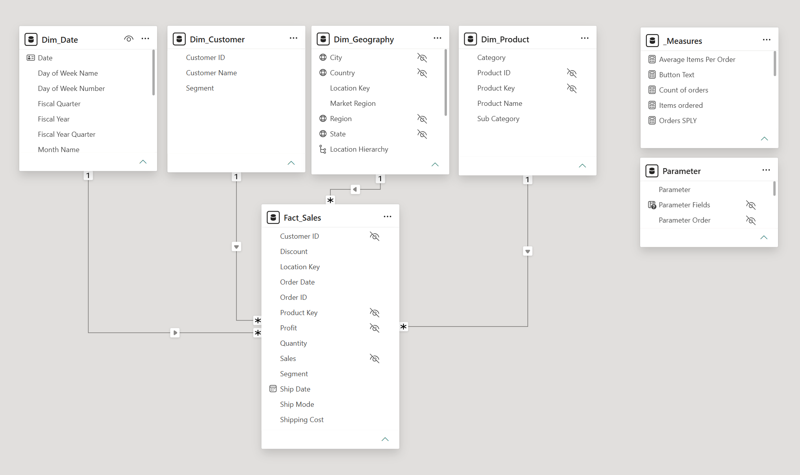

# 📊 POWER BI - GLOBAL SUPERSTORE

[](#)


> **Live Interactive Report:** [Link to embedded Power BI publish-to-web link or demo]  
> **Documentation / Full Writeup:** [Link to GitHub Pages site if hosted separately]

---

## 📌 Executive Summary & Business Problem
* **Business Need:** The sales team requested a report so they could track key performance indicators to make sure they are on track to reach their business goals. They also needed to understand what the key products are by region and be able to highlight any issues or products that are impacting the bottom line.
* **Objective:** Build an automated Power BI report to track regional KPIs, highlight low-margin products, and identify any risk.
* **Target Audience:** Regional Sales Managers and Senior VP of Sales.

---

## 🛠️ Data Architecture & Pipeline
Briefly outline the flow of data from source to report:

`[Raw Data Source: CSV flat table]` ➔ `[Power Query Transformation]` ➔ `[Star Schema Data Model]` ➔ `[DAX Analytics]` ➔ `[Power BI Dashboard]`

* **Data Sources:** One large CSV file
* **ETL Processes (Power Query / M):**
  * As the data was flat and we needed to break it apart in order to create our star schema. I referenced the original source and disabled load in order to create the other tables.
  * I create my dimension tables; product, customer and geography. Then created my fact table called sales.\
  * Removed columns that were not needed.
  * Removed duplicates from the dimension tables.
  * Merged certain columns to create composite keys to then create relationships. (Due to limitations in the data source, some of those keys have a data type of text, which is not ideal. In the real work, I would create an integer surrogate key upstream or perhaps even in Power Query) 
  * Removed duplicate transaction.
  * Upon checking, there were no NULL values.
  

---

## 📐 Data Modeling (Star Schema)
Show off your data architecture skills! 

*(Include an image or diagram of your Model View)*  


* **Model Type:** Star Schema (1 Fact Table, 4 Dimension Tables)
* **Key Dimensions:** `Dim_Customer`, `Dim_Product`, `Dim_Date`, `Dim_Geography`
  * Dim_Date was created using DAX and marked as the date table.
  * Location data categories were used for the Dim_geography table and hierarchies created.
  * Unnecessary columns where hiden from view for report viewers. 
* **Fact Table:** `Fact_Sales`
* **Relationships:** Enforced `1-to-Many` single-direction relationships to optimise DAX performance and prevent circular dependencies.


## 📐 Key DAX Measures & Analytics
* **Parameters:** Created to hold the following measures; Total Revenue, Total Profit and Total Orders. This enabled report users have more control especially on the overview report page so they would be able to see the page by each parameter. 

### 1. Same Period Last Year
Uses the SWITCH() and the SELECTEDVALUE() function to be able to provide last year's value depending on the Parameter Selected
```
SPLY = 
SWITCH(
    SELECTEDVALUE(Parameter[Parameter Fields]),
    "'_Measures'[Total Revenue]", [Revenue Last Year],
    "'_Measures'[Total Profit]", [Profit SPLY],
    "'_Measures'[Total Orders]", [Orders SPLY], 
    BLANK()
)
```

### 2. Profit YoY Growth %
Created many time inteligence measures, some with variables for faster performance and better readability. Below is an example of calculating the Profit growth from the same period last year.
```
Profit YoY Growth % = 
VAR YoYprofitvariance = [Total Profit] - [Profit SPLY]
RETURN
    DIVIDE(
        YoYprofitvariance, 
        [Profit SPLY],
        0
)
```

## 🔍 Exploratory Data Analysis (EDA)
Before constructing dashboard visuals, preliminary data exploration was conducted to uncover underlying patterns, distribution anomalies, and operational drivers.

### 1. Data Distribution & Outliers
* **Discount Threshold:** Orders with discounts exceeding **20%** consistently yielded negative profit margins across all categories.
* **Shipping Lead Times:** High variance was detected in shipping lead times, ranging from **1 day (Same Day)** to **7+ days (Standard Class)**, skewing customer satisfaction metrics in specific regions.

### 2. Key Exploratory Findings
| Metric / Dimension | Observation | Potential Business Action |
| :--- | :--- | :--- |
| **Top Sub-Category** | *Technology (Phones)* and *Furniture (Chairs)* generated the highest gross revenue. | Reallocate marketing budget to maximize stock availability. |
| **Lowest Margin Region** | *Central US* and *LATAM* displayed negative profit margins despite high sales volume. | Audit localized promotional discounts and shipping overhead. |
| **Shipping Delay Rate** | 18% of *Standard Class* orders missed their estimated delivery window. | Renegotiate carrier SLAs for high-volume logistics routes. |

### 3. Data Cleansing & Quality Checks Applied
* **Null Values:** Inferred missing postal code values using City/State dimensions.
* **Duplicates:** Filtered out duplicate `Order ID` + `Product ID` line items to prevent double-counting revenue.
* **Outlier Capping:** Verified extreme shipping costs against regional logistics reference tables.

