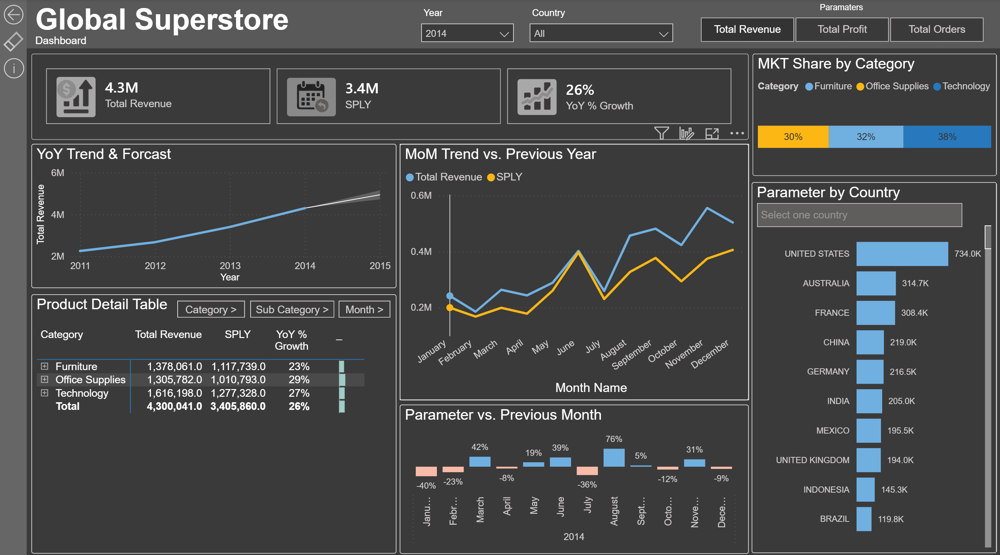
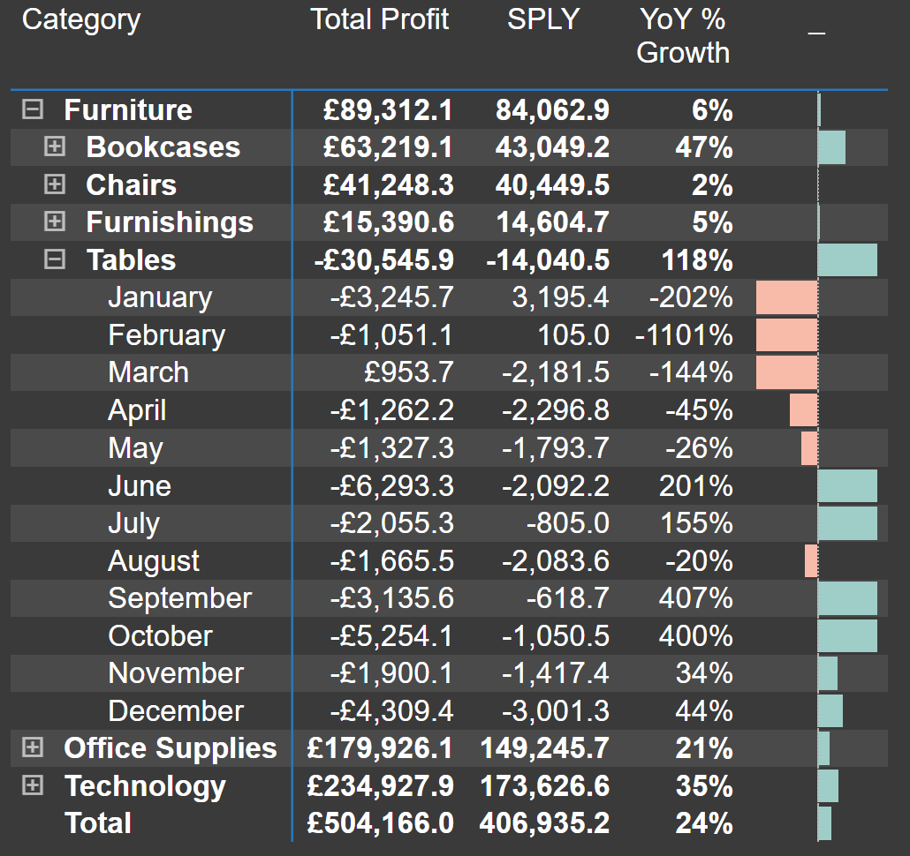

# 📊 Global Superstore Analysis

> **Live Interactive Report:** [Link to embedded Power BI publish-to-web link or demo]  

---

## 📌 Background and Overview
Global Supertore is an online retailer that distributes products across the globe. Specialising - from what I can see in the dataset - office furniture, supplies and technology. With data available from 2011 - 2014 we will endeavour to answer the following questions using Power BI:

* Analysing Sales by Revenue and Orders, and how we are tracking over the years?
* Looking at sales by month and year, do we see a seasonality pattern?  
* Which products are top sellers and which are our worst sellers? Do we need to remove/replace items from our inventory?   
* What products have the lowest and highest profit margin?  
* What is the distribution of customers by country?  
* Are we at risk of being too heavily weighted in one country/product?

<!--• Analysing Sales by Revenue and Orders, and how we are tracking over the years?-->

**KPI:**
Sales, Revenue, Profit Margin.  
**Objective:** Build a Power BI report to track KPIs and answer the above questions.  
**Target Audience:** Regional Sales Managers and Senior VP of Sales.  

---

## 🛠️ ETL
For a brief outline of the flow of data and ETL, see the [DataArch](DataArch.md).

## 📐 Data Modeling (Star Schema)
See data model here [Schema](Schema.png).

* **Model Type:** Star Schema (1 Fact Table, 4 Dimension Tables)
* **Key Dimensions:** `Dim_Customer`, `Dim_Product`, `Dim_Date`, `Dim_Geography`
  * Dim_Date was created using DAX and marked as the date table.
  * Location data categories were used for the Dim_geography table and hierarchies created.
  * Unnecessary columns where hiden from view for report viewers. 
* **Fact Table:** `Fact_Sales`
* **Relationships:** Enforced `1-to-Many` single-direction relationships to optimise DAX performance and prevent circular dependencies.

## 📐 Key DAX Measures & Analytics
For a breakdown of key DAX measures used in this report, see the [DAX Code Documentation](DAX_DOCUMENTATION.md).

* **Parameters:** Created to hold the following measures; Total Revenue, Total Profit and Total Orders. This enabled report users have more control, especially on the overview report page so they would be able to see the page by each parameter.
  
---

## 🔍 Executive Summary
Global Superstore achieved a Total Revenue of 12.6M from 25K Orders from 2011 to 2014.  
Although the share of revenue between the categories of furniture, office supplies and technology is similar, ranging between 30% - 38%, the number of orders for office supplies is close to double that of furniture and technology and accounts for 53% of all orders made.  
Based on previous years, we are forecasting revenue to reach 5M for 2015, which would be a growth of 16% vsthe  previous year, this would be 10% less than we had grown YoY IN 2014 (26% up from 2013).  
Even though our furniture category revenue accounts for a 30% share of all revenue, the profit from furniture only accounts for 18% of all profit made. When compared to the profit made vs Office supplies and technology its making less than half the profit of Office Supplies and Technology.  

## 🔍 Insights

Revenue, orders and profit all ended the year 24%-26% up verses previous year.  
Sales trends remain the same yoy, increasing as we progress through the year, with peak months June, September and November. Whilst dips in July and October remain.   
The United States still remains our number one key market with a 20% market share, followed by Australia who replaces Mexico in second place.  

When looking into our profit, what is concerning is that the money is negative when looking at table sales under the category of furniture. We can see that in 2014 alone are not even covering our costs and have lost 30k. Our pricing and shipping costs need to be looked at in order to bring these products in line with our business objectives.  

I created a scatter chart to plot the relationship between profit and revenue, and that's when I first noticed the outlier of our table subcategory.

I then created a decomposition tree, and upon investigation, it seems like the negative values are specifically affecting certain regions and only specific products. 

## 🔍 Exploratory Data Analysis (EDA)
Before constructing dashboard visuals, preliminary data exploration was conducted to uncover underlying patterns, distribution anomalies, and operational drivers.

### 1. Data Distribution & Outliers
* **Discount Threshold:** Orders with discounts exceeding **20%** consistently yielded negative profit margins across all categories.
* **Shipping Lead Times:** High variance was detected in shipping lead times, ranging from **1 day (Same Day)** to **7+ days (Standard Class)**, skewing customer satisfaction metrics in specific regions.

### 2. Key Exploratory Findings
| Metric / Dimension | Observation | Potential Business Action |
| :--- | :--- | :--- |
| **Top Sub-Category** | *Technology (Phones)* and *Furniture (Chairs)* generated the highest gross revenue. | Reallocate marketing budget to maximize stock availability. |
| **Lowest Margin Region** | *Central US* and *LATAM* displayed negative profit margins despite high sales volume. | Audit localized promotional discounts and shipping overhead. |
| **Shipping Delay Rate** | 18% of *Standard Class* orders missed their estimated delivery window. | Renegotiate carrier SLAs for high-volume logistics routes. |

### 3. Data Cleansing & Quality Checks Applied
* **Null Values:** Inferred missing postal code values using City/State dimensions.
* **Duplicates:** Filtered out duplicate `Order ID` + `Product ID` line items to prevent double-counting revenue.
* **Outlier Capping:** Verified extreme shipping costs against regional logistics reference tables.

